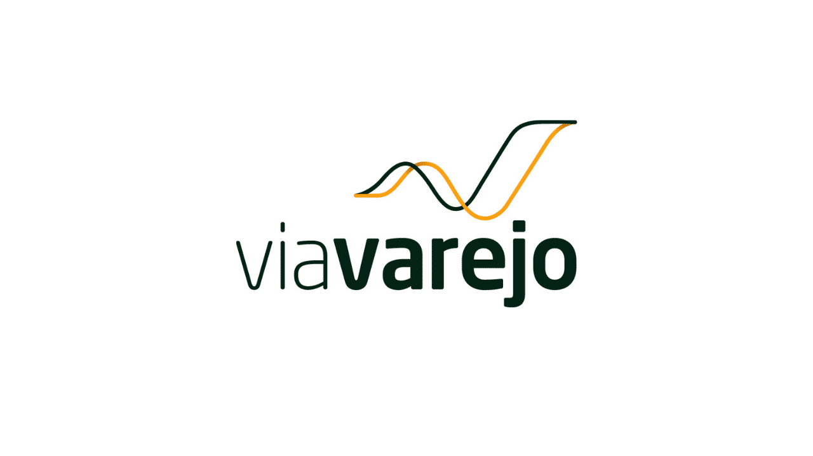

<!--  -->

# Controle Financeiro

Projeto focado em ajudar a organizar os gastos sobre transações de compra e venda, mostrando o total final e se obteve lucro ou prejuízo.

## Instalando

Para rodar o projeto basta clonar o repositório através do comando abaixo

```shell
git clone https://github.com/Thialves02/Via-Varejo.git
```
Após clonar o projeto basta abrir o arquivo "desafio.html".

## Desenvolvimento

### Construido com
O projeto foi feito utilizando HTML, CSS, Javascript e a biblioteca Jquery na versão 3.6.0

